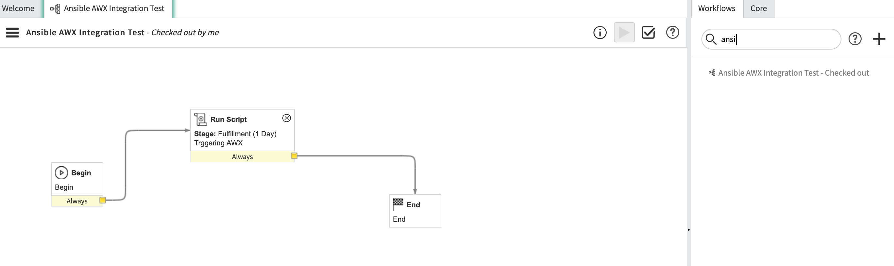
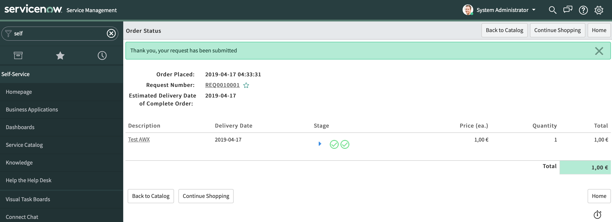

# ansible-servicenow-integration

  <a href="#Getting-Started">Getting Started</a> •
  <a href="#Tower-CLI">Tower CLI</a> •
  <a href="#API">API</a> •
  <a href="#Notifications">Notifications</a> •
  <a href="#Docker-Security">Docker Security</a> •
  <a href="#related">Related</a> •
  <a href="#Authors">Authors</a>

 

In short, you have to create the Ansible AWX endpoint and a workflow as shown below (you can also add approvals, permissions, notification, etc):

Wrapping all the above in a catalog item and order it.

The workflow is just running a "hello world" playbook but it can trigger any playbook available. 

## Getting Started
To run an Ansible Playbook with AWX, you need to configure the following items
- Credentials: User name/password or ssh key to connect to remote component
- Project: It contains the Ansible playbook, config, roles, templates etc
- Inventories : What servers the playbook will run against and connection specific configuration
- Templates: Job template to associate all of the above and run the playbook
- Launch Templates: Launching current project

## Related

* [Ansible Modules](https://docs.ansible.com/ansible/latest/modules/modules_by_category.html) - List of Ansible modules
* [ServiceNow Sandbox](https://developer.servicenow.com/app.do#!/home) - Request ServiceNow sandbox

## Authors

* **Javier Baltar** - *Initial work* - [GitHub](https://github.com/JavierBaltar)

