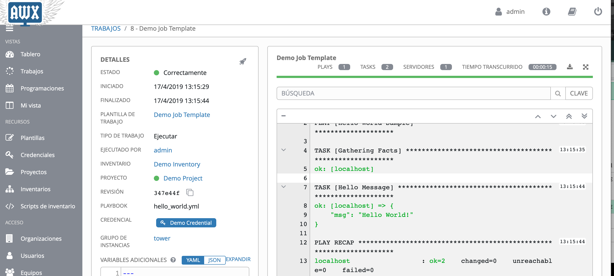

# ansible-servicenow-integration

  <a href="#Getting-Started">Getting Started</a> •
  <a href="#Workflow">Workflow</a> •
  <a href="#related">Related</a> •
  <a href="#Authors">Authors</a>

 

## Getting Started

In short, you have to create the Ansible AWX endpoint and a workflow as shown below (you can also add approvals, permissions, notification, etc):

## Workflow
### Create ServiceNow AWX endpoint
The workflow is just running a "hello world" playbook but it can trigger any playbook available. 

### Order your request

### AWX Playbook is executed 

## Related

* [Ansible Modules](https://docs.ansible.com/ansible/latest/modules/modules_by_category.html) - List of Ansible modules
* [ServiceNow Sandbox](https://developer.servicenow.com/app.do#!/home) - Request ServiceNow sandbox

## Authors

* **Javier Baltar** - *Initial work* - [GitHub](https://github.com/JavierBaltar)

